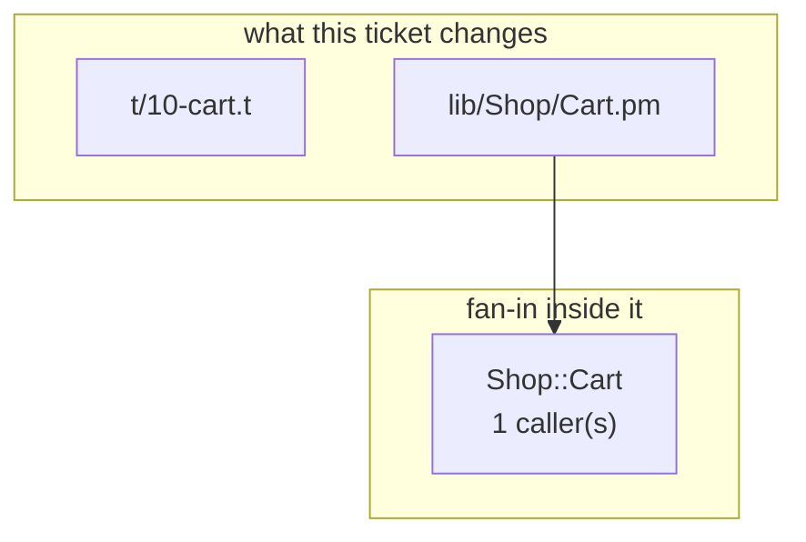

# perl-cart-c3 — build document

**Spec:** `perl-cart-c3` · **Derived at:** `f4b10ae` · **Status:** proposed

**Validity:** PROCEED

Assembled by `orchestrator sdlc plan`. No code was written and nothing was spent. Every section carries where it came from.

---

## 1. Requirement
*stated — the ticket body, quoted*

**Shop Cart subtotal and tax total**

Implement Shop::Cart, a small Perl shopping cart with subtotal and total methods.

## 2. Intent
*derived · model — `intake/specs.py` — the spec writer*

_No user story on the spec._

## 3. Root cause
*not established — no exception and no file named — nothing to localize, so nothing is claimed*

## 4. PKG — what the graph knows
*derived · deterministic — `FactStore` @ `f4b10ae`*

| symbol | kind | where | callers | module |
|---|---|---|---|---|
| `test_cart_subtotal_and_total` | Function | `t/10-cart.t:20` | 0 | `t/10-cart.t` |
| `Shop::Cart` | Type | `lib/Shop/Cart.pm:1` | 1 | `lib/Shop/Cart.pm` |
| `subtotal` | Function | `lib/Shop/Cart.pm:116` | 12 | `lib/Shop/Cart.pm` |
| `total` | Function | `lib/Shop/Cart.pm:136` | 10 | `lib/Shop/Cart.pm` |
| `lib/Shop/Cart.pm` | Module | `lib/Shop/Cart.pm:1` | 0 | `lib/Shop/Cart.pm` |
| `t/10-cart.t` | Module | `t/10-cart.t:1` | 0 | `t/10-cart.t` |
| `tax_rate` | Function | `lib/Shop/Cart.pm:102` | 5 | `lib/Shop/Cart.pm` |
| `test_cart_defaults_and_empty` | Function | `t/10-cart.t:49` | 0 | `t/10-cart.t` |
| `test_cart_rejects_invalid_input` | Function | `t/10-cart.t:78` | 0 | `t/10-cart.t` |
| `test_cart_distribution_declares_prereqs` | Function | `t/20-dist-metadata.t:20` | 0 | `t/20-dist-metadata.t` |

**Areas:** `t/10-cart.t`, `lib/Shop/Cart.pm`, `t/20-dist-metadata.t`

**The brief agrees with the design** on 2 file(s): `lib/Shop/Cart.pm`, `t/10-cart.t`.

## 5. Blast radius
*derived · deterministic — `sdlc/impact.py` @ `f4b10ae`*

**Reading it:** 2 module(s) change; 0 module(s) import them, and 1 symbol(s) inside them carry the fan-in.

**Containment:** nothing in the graph imports what changes. A change here cannot propagate outward.

**Caveat:** method calls through an instance emit no `CALLS` edge (SSPN-48), so per-method counts under-report. Module-function counts are exact. Measured `CALLS` recall for perl is **0.89** (against the extractor's own test corpus, not this repository) — treat this list as a lower bound.

**Evidence:**
- *Coverage today:* 0 of 12 symbol(s) in the files this ticket changes are reached by no test. Reached by a test means exercised, not asserted correct.
- *Endpoints crossed:* none joined. A path built from an f-string or a variable yields no edge, so this is silence rather than absence.
- *Regression surface:* no test module imports what changes.
- *Recent history:*
    - f4b10ae 2026-09-13 DRY-1: Shop Cart subtotal and tax total

## 6. Design
*derived · deterministic — `sdlc/design.py` — the deterministic heuristic (no LLM)*

Implement 'Shop Cart subtotal and tax total' following the repo's existing structure and conventions.

*Risks, as the design states them:*

- Heuristic design (no LLM) — confirm the affected files before building.

**Test strategy:** Add tests covering each acceptance criterion: Shop::Cart->new(items => [{price => 10, quantity => 2}, {price => 5, quantity => 1}], tax_rate => 0.1) constructs a cart; subtotal returns 25 and total returns 27.5.; An omitted or empty items array has subtotal and total zero; omitted tax_rate defaults to zero.; Reject negative item prices, nonpositive or noninteger quantities, and negative tax rates with a useful error.; Calculating subtotal and total does not mutate the supplied items.; Executable Test::More tests load Shop::Cart and assert normal, empty, error and immutability cases; use strict and warnings and document public methods with POD.

## 7. Files
*derived · deterministic — the paths the spec states, plus the design*

**Changed**

| file | size |
|---|---|
| `t/10-cart.t` | 7,136 b |
| `lib/Shop/Cart.pm` | 3,534 b |

## 8. Acceptance criteria
*stated + derived · model — the spec, reconciled against the code*

| # | Criterion | State | Satisfied by |
|---|---|---|---|
| 1 | Shop::Cart->new(items => [{price => 10, quantity => 2}, {price => 5, quantity => 1}], tax_rate => 0.1) constructs a cart; subtotal returns 25 and total returns 27.5. | stated | — |
| 2 | An omitted or empty items array has subtotal and total zero; omitted tax_rate defaults to zero. | stated | — |
| 3 | Reject negative item prices, nonpositive or noninteger quantities, and negative tax rates with a useful error. | stated | — |
| 4 | Calculating subtotal and total does not mutate the supplied items. | stated | — |
| 5 | Executable Test::More tests load Shop::Cart and assert normal, empty, error and immutability cases; use strict and warnings and document public methods with POD. | stated | — |

## 9. Facts the generator needs
*not established — reading the named source for what must not be duplicated — no phase owns this yet*

## 10. Codegen prompt
*derived · deterministic — `sdlc/codegen.py` — prompt assembly*

**System:** `_IMPLEMENT_SYSTEM` (perl)

**User payload:** sections 1, 6 and 8 of this document, plus the files below whole.

**Context:** 10,670 b of 200,000 — 5%.

## 11. Token usage & cost
*derived · deterministic (estimate) — the installed model catalog*

**No measured history for this ticket** — nothing has been run yet, so the below is an estimate.

**Estimated** from the 10,670 b this prompt carries: ~2,667 input tokens (at ~4 chars/token), and between 0 and 32,000 output — codegen's cap covers thinking plus reply, and the width of that band *is* the uncertainty.

| model | provider | $/Mtok in | $/Mtok out | this prompt, low–high |
|---|---|---|---|---|
| `claude-opus-5` *(resolved)* | anthropic | 5.00 | 25.00 | $0.01–0.81 |
| `claude-opus-4-5` | anthropic | 5.00 | 25.00 | $0.01–0.81 |
| `claude-opus-4-5-20251101` | anthropic | 5.00 | 25.00 | $0.01–0.81 |
| `claude-opus-4-6` | anthropic | 5.00 | 25.00 | $0.01–0.81 |
| `chat-latest` | openai | 5.00 | 30.00 | $0.01–0.97 |
| `chatgpt-4o-latest` | openai | 5.00 | 15.00 | $0.01–0.49 |
| `gpt-4o-2024-05-13` | openai | 5.00 | 15.00 | $0.01–0.49 |
| `gemini/gemini-3-pro-preview` | gemini | 2.00 | 12.00 | $0.01–0.39 |
| `gemini/gemini-3.1-pro-preview` | gemini | 2.00 | 12.00 | $0.01–0.39 |
| `gemini/gemini-3.1-pro-preview-customtools` | gemini | 2.00 | 12.00 | $0.01–0.39 |

_Nearest 3 by input price per provider, of 2,210 priced models — a like-for-like swap, not a ranking. `orchestrator models --provider <name>` lists them all._

**A failed run costs what a successful one costs.** The prompt is resent on every corrective attempt, so the bill scales with attempts, not with outcomes.

## 12. Confidence
*derived · deterministic — what the plan could and could not establish — a band, never a score*

**Is the analysis right? — high** (4 of 4 applicable checks positive). A band, not a percentage: nothing here measures correctness, only how much the plan managed to establish.

| what the plan established | reading | weight |
|---|---|---|
| Validity gate | PROCEED — nothing contradicts the code | + |
| Where it lands | the brief and the design name the same files | + |
| Root cause | nothing to localize — not a bug, so nothing is owed | n/a |
| Named paths | every path the design names is in the graph | + |
| Context budget | the named files fit the window whole | + |

**Will an unattended run complete? — unestablished.** No run of this ticket has happened, so there is no base rate. Nothing here should be read as optimism.

## Recorded live execution

This build document was assembled after execution from the resulting checkout; its proposed
plan status is the plan renderer's status, not the live run verdict. The spec was hand-written
and injected, so intake was skipped. Actual codegen and judge model: **claude-opus-5**.
Run: `d4332deeca274d04`, generated commit `f4b10aef3bf15fd060e3eec4a4d8a513e7fff569`.
Runtime grounding was **309 characters**, independently matched by MCP `pkg_grounding`
on the pre-generation scaffold (`perl:Shop.Cart`, Perl fence). After generation it is
**5,175 characters**. The run selected `perl-conventions`, installed dependencies through
real `cpanm`, passed tests, proved they fail without the change, and received judge approval.
An independent clean clone passed real `prove -l t/`: **3 files, 81 assertions**.
MCP `blast_radius(subtotal)` records 12 call sites, including three named test subroutines.
