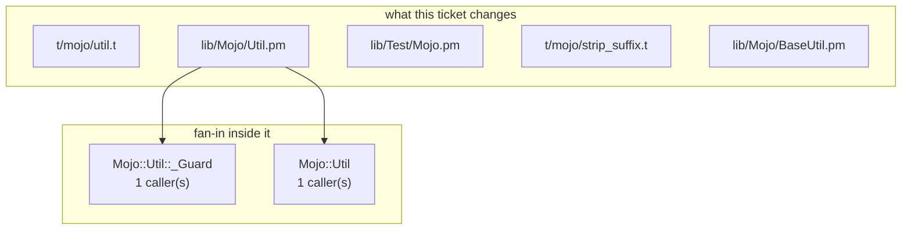

# perl-util-c4 — build document

**Spec:** `perl-util-c4` · **Derived at:** `fc010fd` · **Status:** proposed

**Validity:** PROCEED

Assembled by `orchestrator sdlc plan`. No code was written and nothing was spent. Every section carries where it came from.

---

## 1. Requirement
*stated — the ticket body, quoted*

**Mojo Util trailing text removal**

Add strip_suffix to the existing Mojo::Util package in lib/Mojo/Util.pm, with owning tests in t/mojo/util.t.

## 2. Intent
*derived · model — `intake/specs.py` — the spec writer*

_No user story on the spec._

## 3. Root cause
*derived · deterministic — `sdlc/rca.py` @ `fc010fd` — hypotheses, not a verdict*

**Fault site:** `lib/Mojo/Util.pm` — named by the ticket, not localized to a line.

⚠ This module changed recently — a regression is the leading hypothesis.

**Hypotheses, ranked — evidence, not a verdict:**

1. **[high]** Recent change to `lib/Mojo/Util.pm` — likely a regression; review its latest commits.
    - `lib/Mojo/Util.pm` was modified in the recent git history.
2. **[medium]** The fault is in `lib/Mojo/Util.pm`, `t/mojo/util.t` — named by the ticket, not localized to a line. Read the file before assuming where.
    - The text names `lib/Mojo/Util.pm`, `t/mojo/util.t`, and the graph knows them.

**Consequence:** the ticket establishes the file, not the line — nothing inside `lib/Mojo/Util.pm` is ruled out yet.

## 4. PKG — what the graph knows
*derived · deterministic — `FactStore` @ `fc010fd`*

| symbol | kind | where | callers | module |
|---|---|---|---|---|
| `test_strip_suffix` | Function | `t/mojo/util.t:17` | 0 | `t/mojo/util.t` |
| `lib/Mojo/Util.pm` | Module | `lib/Mojo/Util.pm:1` | 0 | `lib/Mojo/Util.pm` |
| `lib/Test/Mojo.pm` | Module | `lib/Test/Mojo.pm:1` | 0 | `lib/Test/Mojo.pm` |
| `t/mojo/strip_suffix.t` | Module | `t/mojo/strip_suffix.t:1` | 0 | `t/mojo/strip_suffix.t` |
| `Mojo::Util` | Type | `lib/Mojo/Util.pm:1` | 1 | `lib/Mojo/Util.pm` |
| `strip_suffix` | Function | `lib/Mojo/Util.pm:388` | 30 | `lib/Mojo/Util.pm` |
| `Test::Mojo` | Type | `lib/Test/Mojo.pm:1` | 0 | `lib/Test/Mojo.pm` |
| `lib/Mojo/BaseUtil.pm` | Module | `lib/Mojo/BaseUtil.pm:1` | 0 | `lib/Mojo/BaseUtil.pm` |
| `t/mojo/lib/Mojo/DeprecationTest.pm` | Module | `t/mojo/lib/Mojo/DeprecationTest.pm:1` | 0 | `t/mojo/lib/Mojo/DeprecationTest.pm` |
| `t/mojo/lib/Mojo/LoaderTest/A.pm` | Module | `t/mojo/lib/Mojo/LoaderTest/A.pm:1` | 0 | `t/mojo/lib/Mojo/LoaderTest/A.pm` |

**Areas:** `t/mojo/util.t`, `lib/Mojo/Util.pm`, `lib/Test/Mojo.pm`, `t/mojo/strip_suffix.t`, `lib/Mojo/BaseUtil.pm`, `t/mojo/lib/Mojo/DeprecationTest.pm`, `t/mojo/lib/Mojo/LoaderTest/A.pm`

**The brief agrees with the design** on 5 file(s): `lib/Mojo/BaseUtil.pm`, `lib/Mojo/Util.pm`, `lib/Test/Mojo.pm`, `t/mojo/strip_suffix.t`, `t/mojo/util.t`.

## 5. Blast radius
*derived · deterministic — `sdlc/impact.py` @ `fc010fd`*

**Reading it:** 5 module(s) change; 0 module(s) import them, and 2 symbol(s) inside them carry the fan-in.

**Containment:** nothing in the graph imports what changes. A change here cannot propagate outward.

**Caveat:** method calls through an instance emit no `CALLS` edge (SSPN-48), so per-method counts under-report. Module-function counts are exact. Measured `CALLS` recall for perl is **0.89** (against the extractor's own test corpus, not this repository) — treat this list as a lower bound.

**Evidence:**
- *Coverage today:* 50 of 141 symbol(s) in the files this ticket changes are reached by no test — untested: `DESTROY`, `Mojo::BaseUtil`, `Mojo::Util`, `Mojo::Util::_Guard`, `_adapt`, `_entity`, `_header`, `_html` (+42 more). Reached by a test means exercised, not asserted correct.
- *Endpoints crossed:* none joined. A path built from an f-string or a variable yields no edge, so this is silence rather than absence.
- *Regression surface:* no test module imports what changes.
- *Recent history:*
    - fc010fd 2026-09-13 DRY-1: Mojo Util trailing text removal
    - 93f5917 2026-08-10 Bump version

## 6. Design
*derived · deterministic — `sdlc/design.py` — the deterministic heuristic (no LLM)*

Implement 'Mojo Util trailing text removal' following the repo's existing structure and conventions.

*Risks, as the design states them:*

- Heuristic design (no LLM) — confirm the affected files before building.

**Test strategy:** Add tests covering each acceptance criterion: Mojo::Util::strip_suffix($text, $suffix) returns a copy with exactly one matching literal suffix removed; unmatched or empty suffix leaves text unchanged.; Matching is case sensitive; regex metacharacters are literal; Unicode character strings work; removing a suffix equal to the entire string returns an empty string.; Neither input argument is mutated, including when the first argument is a literal or read-only value. Repeated suffixes lose exactly one copy.; Export strip_suffix through the existing @EXPORT_OK and document it in the existing POD style. Preserve the package clause, existing functions, build configuration and dependencies. POD examples must be accurate: strip_suffix('testbarbar', 'bar') returns 'testbar'.; Add executable Test::More coverage to t/mojo/util.t for every behavior, inside a named test_strip_suffix subroutine invoked by `test_strip_suffix();` from the test file. Call Mojo::Util::strip_suffix explicitly inside that subroutine so its test caller is visible in the graph. Owning tests and the full existing suite pass.

## 7. Files
*derived · deterministic — the paths the spec states, plus the design*

**Changed**

| file | size |
|---|---|
| `t/mojo/util.t` | 40,904 b |
| `lib/Mojo/Util.pm` | 28,800 b |
| `lib/Test/Mojo.pm` | 42,125 b |
| `t/mojo/strip_suffix.t` | 721 b |
| `lib/Mojo/BaseUtil.pm` | 1,127 b |

## 8. Acceptance criteria
*stated + derived · model — the spec, reconciled against the code*

| # | Criterion | State | Satisfied by |
|---|---|---|---|
| 1 | Mojo::Util::strip_suffix($text, $suffix) returns a copy with exactly one matching literal suffix removed; unmatched or empty suffix leaves text unchanged. | stated | — |
| 2 | Matching is case sensitive; regex metacharacters are literal; Unicode character strings work; removing a suffix equal to the entire string returns an empty string. | stated | — |
| 3 | Neither input argument is mutated, including when the first argument is a literal or read-only value. Repeated suffixes lose exactly one copy. | stated | — |
| 4 | Export strip_suffix through the existing @EXPORT_OK and document it in the existing POD style. Preserve the package clause, existing functions, build configuration and dependencies. POD examples must be accurate: strip_suffix('testbarbar', 'bar') returns 'testbar'. | stated | — |
| 5 | Add executable Test::More coverage to t/mojo/util.t for every behavior, inside a named test_strip_suffix subroutine invoked by `test_strip_suffix();` from the test file. Call Mojo::Util::strip_suffix explicitly inside that subroutine so its test caller is visible in the graph. Owning tests and the full existing suite pass. | stated | — |

## 9. Facts the generator needs
*not established — reading the named source for what must not be duplicated — no phase owns this yet*

## 10. Codegen prompt
*derived · deterministic — `sdlc/codegen.py` — prompt assembly*

**System:** `_IMPLEMENT_SYSTEM` (perl)

**User payload:** sections 1, 3, 6 and 8 of this document, plus the files below whole.

**Context:** 113,677 b of 200,000 — 57%.

## 11. Token usage & cost
*derived · deterministic (estimate) — the installed model catalog*

**No measured history for this ticket** — nothing has been run yet, so the below is an estimate.

**Estimated** from the 113,677 b this prompt carries: ~28,419 input tokens (at ~4 chars/token), and between 0 and 32,000 output — codegen's cap covers thinking plus reply, and the width of that band *is* the uncertainty.

| model | provider | $/Mtok in | $/Mtok out | this prompt, low–high |
|---|---|---|---|---|
| `claude-opus-5` *(resolved)* | anthropic | 5.00 | 25.00 | $0.14–0.94 |
| `claude-opus-4-5` | anthropic | 5.00 | 25.00 | $0.14–0.94 |
| `claude-opus-4-5-20251101` | anthropic | 5.00 | 25.00 | $0.14–0.94 |
| `claude-opus-4-6` | anthropic | 5.00 | 25.00 | $0.14–0.94 |
| `chatgpt-4o-latest` | openai | 5.00 | 15.00 | $0.14–0.62 |
| `gpt-4o-2024-05-13` | openai | 5.00 | 15.00 | $0.14–0.62 |
| `gpt-5.5` | openai | 5.00 | 30.00 | $0.14–1.10 |
| `gemini/gemini-3-pro-preview` | gemini | 2.00 | 12.00 | $0.06–0.44 |
| `gemini/gemini-3.1-pro-preview` | gemini | 2.00 | 12.00 | $0.06–0.44 |
| `gemini/gemini-3.1-pro-preview-customtools` | gemini | 2.00 | 12.00 | $0.06–0.44 |

_Nearest 3 by input price per provider, of 1,716 priced models — a like-for-like swap, not a ranking. `orchestrator models --provider <name>` lists them all._

**A failed run costs what a successful one costs.** The prompt is resent on every corrective attempt, so the bill scales with attempts, not with outcomes.

## 12. Confidence
*derived · deterministic — what the plan could and could not establish — a band, never a score*

**Is the analysis right? — medium** (4 of 5 applicable checks positive). A band, not a percentage: nothing here measures correctness, only how much the plan managed to establish.

| what the plan established | reading | weight |
|---|---|---|
| Validity gate | PROCEED — nothing contradicts the code | + |
| Where it lands | the brief and the design name the same files | + |
| Root cause | a file at best — no line established | − |
| Named paths | every path the design names is in the graph | + |
| Context budget | the named files fit the window whole | + |

**Will an unattended run complete? — unestablished.** No run of this ticket has happened, so there is no base rate. Nothing here should be read as optimism.

**And the plan raises its own bar:** 50 symbol(s) in the files being changed have no test, so the delivery is larger than the spec implies.

## Recorded live execution

This document was rendered after execution; its proposed-plan status is not the runtime
verdict. The hand-written injected spec was implemented and judged by **claude-opus-5**.
Run `0633287e36ac43c8`, generated commit `fc010fd1149fe483127065d5f23cd4e82594eb39`.
Runtime grounding: **938 characters**, independently matched by MCP; post-generation: **2,446**.
Selected skills: `perl-conventions`, `repo-pkg-grounding`. No cpanfile exists, so the
environment reported installed dependencies instead of invoking cpanm.

The final acceptance verdict is approve. A clean clone passes `perl -I lib -c lib/Mojo/Util.pm`,
then `prove -l t/mojo/util.t` (73 tests), then `prove -l -r t/` (110 files, 4,192 tests in 27.32s).
The host's NO_COLOR override was removed for baseline, live run, and independent rerun.
The upstream suite retains its 20 optional-feature test-file skips.
MCP shows 30 calls from the named owning test to the new helper. Regression gaps across
every named subroutine in the landing package remain 116 before and after; the new helper is covered.
